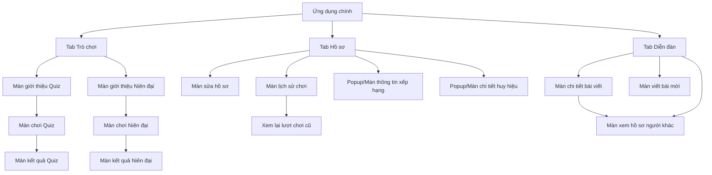

# Tài Liệu Yêu Cầu Thiết Kế Giao Diện (UX/UI Brief)
## Game — Profile — Forum

Tài liệu này tóm tắt cấu trúc thông tin và luồng đi của người dùng (User Flow) cho 3 tính năng cốt lõi. Tài liệu tập trung vào **thông tin cần hiển thị** và **hành động của người dùng**, hoàn toàn không ràng buộc về phong cách thiết kế mỹ thuật (Layout, Colors, Theme, Animations) để đơn vị thiết kế tự do sáng tạo.

---

## Luồng Điều Hướng Tổng Thể (Sitemap)

---

## 1. Tính Năng: Trò Chơi (Game)
Hệ thống trò chơi tương tác giúp người dùng tiếp thu lịch sử thông qua: **Trắc nghiệm (Quiz)** và **Sắp xếp/Ghép nối dòng thời gian (Timeline Puzzle)**.

### 1.1 Màn hình chính Tab Game
* **Mục tiêu**: Nơi người dùng lựa chọn thể loại trò chơi và danh sách chủ đề.
* **Thông tin hiển thị**:
  * Tiêu đề màn hình và lời chào/sub-title ngắn.
  * Phân hệ lựa chọn: Chuyển đổi qua lại giữa danh mục **Trắc nghiệm** và **Ghép niên đại**.
  * **Danh sách Trắc nghiệm**: Các bộ câu hỏi theo chủ đề. Mỗi mục hiển thị:
    * Tiêu đề/chủ đề bộ câu hỏi.
    * Mức độ thử thách (Ví dụ: Dễ, Trung bình, Khó).
    * Quy mô (Số lượng câu hỏi).
  * **Danh sách Ghép Niên Đại**: Các thời kỳ lịch sử. Mỗi mục hiển thị:
    * Tên thời kỳ/kỷ nguyên lịch sử.
    * Mô tả tóm tắt bối cảnh thời kỳ.
    * Ảnh đại diện minh họa cho thời kỳ (nếu có).
* **Hành động chính**:
  * Chuyển đổi giữa 2 phân hệ trò chơi.
  * Nhấp chọn một bộ câu hỏi hoặc một thời kỳ lịch sử để xem thông tin chi tiết.

### 1.2 Phân hệ Trắc nghiệm (Quiz)

#### 1.2.1 Màn giới thiệu bộ câu hỏi
* **Mục tiêu**: Cung cấp thông tin tổng quan trước khi người dùng thực sự bắt đầu chơi.
* **Thông tin hiển thị**:
  * Tên bộ câu hỏi trắc nghiệm.
  * Độ khó và số lượng câu hỏi trong bộ đề.
  * Giới hạn thời gian làm bài (Ví dụ: 30 giây/câu) hoặc các lưu ý khác.
* **Hành động chính**:
  * Nút "Bắt đầu chơi".
  * Nút "Quay lại" danh sách game.

#### 1.2.2 Màn hình chơi trắc nghiệm
* **Mục tiêu**: Người dùng tập trung trả lời các câu hỏi trắc nghiệm dưới dạng câu hỏi 4 đáp án lựa chọn.
* **Thông tin hiển thị**:
  * Chỉ số tiến độ (Ví dụ: `Câu 3/10`) và thanh tiến trình trực quan.
  * Đồng hồ đếm ngược thời gian của câu hỏi hiện tại.
  * Nội dung câu hỏi lịch sử.
  * 4 phương án trả lời (A, B, C, D).
  * **Trạng thái sau khi trả lời** (hoặc hết giờ):
    * Phản hồi đúng/sai trực quan cho đáp án được chọn và đáp án đúng.
    * Đoạn văn bản giải thích kiến thức lịch sử liên quan đến câu hỏi.
* **Hành động chính**:
  * Chọn một phương án trả lời (sau đó khóa lựa chọn).
  * Nút "Câu tiếp theo" hoặc "Xem kết quả" (hiển thị sau khi đã trả lời xong câu hỏi hiện tại).

#### 1.2.3 Màn hình kết quả trắc nghiệm
* **Mục tiêu**: Tổng kết thành tích và trao thưởng điểm kinh nghiệm (XP) cho người dùng.
* **Thông tin hiển thị**:
  * Lời đánh giá hoặc xếp loại kết quả (Xuất sắc, Đạt, Cần cố gắng).
  * Thống kê trận đấu: Số câu đúng/tổng số câu, điểm số đạt được, tổng thời gian hoàn thành.
  * Phần thưởng: Điểm kinh nghiệm nhận được (XP), thông báo thăng cấp hạng (nếu có).
  * Huy hiệu mới mở khóa (nếu đạt điều kiện).
  * **Danh sách xem lại bài làm**: Cho phép người dùng cuộn xem lại toàn bộ các câu hỏi đã trả lời, đáp án họ chọn, đáp án đúng và phần giải thích tương ứng.
* **Hành động chính**:
  * Nút "Chơi lại".
  * Nút "Trở về" danh sách chính.

---

### 1.3 Phân hệ Ghép Niên Đại (Timeline Puzzle)

#### 1.3.1 Màn giới thiệu thời kỳ
* **Mục tiêu**: Giới thiệu bối cảnh thời kỳ lịch sử và hướng dẫn luật chơi.
* **Thông tin hiển thị**:
  * Tên thời kỳ/kỷ nguyên lịch sử.
  * Số lượng sự kiện cần sắp xếp.
  * Mô tả lịch sử tóm tắt.
  * Hướng dẫn cách chơi (Luật ghép theo thứ tự thời gian).
* **Hành động chính**:
  * Nút "Bắt đầu chơi".
  * Nút "Quay lại" danh sách game.

#### 1.3.2 Màn chơi ghép niên đại
* **Mục tiêu**: Sắp xếp các sự kiện lịch sử theo đúng trình tự thời gian từ trước đến sau.
* **Thông tin hiển thị**:
  * Tiến độ hoàn thành (Ví dụ: `3/8 sự kiện đã xếp`).
  * Chỉ số sinh mạng/số lượt được phép làm sai trước khi thua cuộc.
  * Đồng hồ đếm thời gian chơi.
  * **Dòng thời gian đích**: Các ô trống để người dùng đặt các sự kiện vào.
  * **Bộ thẻ sự kiện lịch sử**: Danh sách các sự kiện chưa được sắp xếp (hiển thị tiêu đề sự kiện, ẩn mốc thời gian để người dùng suy luận).
  * **Trạng thái tương tác**:
    * Khi ghép đúng: Sự kiện khóa vào dòng thời gian đích, hiển thị mốc năm và mô tả chi tiết sự kiện.
    * Khi ghép sai: Cảnh báo trực quan (rung lắc, trừ mạng sống/HP).
* **Hành động chính**:
  * Chọn thẻ sự kiện để xếp vào vị trí tiếp theo trên dòng thời gian.
  * Nút thoát trò chơi giữa chừng.

#### 1.3.3 Màn hình kết quả ghép niên đại
* **Mục tiêu**: Hiển thị dòng thời gian hoàn chỉnh và trao thưởng.
* **Thông tin hiển thị**:
  * Trạng thái trận đấu: Chiến thắng (ghép đúng tất cả) hoặc Thua cuộc (hết mạng sống).
  * Điểm số và số điểm kinh nghiệm (XP) tích lũy được.
  * **Bảng dòng thời gian chuẩn**: Danh sách các sự kiện được xếp theo thứ tự năm từ sớm nhất đến muộn nhất để người dùng tham khảo đầy đủ.
* **Hành động chính**:
  * Nút "Chơi lại".
  * Nút "Trở về" danh sách chính.

---

## 2. Tính Năng: Hồ Sơ Cá Nhân (Profile & Gamification)
Quản lý thông tin định danh người dùng và hiển thị tiến trình thăng hạng, các huy hiệu đạt được.

### 2.1 Màn hình chính Hồ sơ (Profile)
* **Mục tiêu**: Trang trung tâm hiển thị toàn bộ thành tích cá nhân của người dùng.
* **Thông tin hiển thị**:
  * **Thông tin cá nhân**: Ảnh đại diện (Avatar), tên hiển thị (Display Name), tên đăng nhập (Username).
  * **Hệ thống Xếp hạng (Rank)**:
    * Cấp hạng hiện tại (Ví dụ: Đồng, Bạc, Vàng, Huyền thoại) kèm biểu tượng cấp hạng.
    * Điểm kinh nghiệm hiện tại (XP).
    * Tiến độ thăng hạng tiếp theo (Số XP cần tích lũy thêm và thanh tiến trình trực quan).
  * **Chỉ số thống kê tích lũy**:
    * Tổng số lượt chơi đã hoàn thành.
    * Điểm số cao nhất từng đạt được.
    * Chuỗi ngày chơi liên tục hiện tại (Streak) và kỷ lục chuỗi ngày chơi dài nhất.
  * **Lưới thành tích/Huy hiệu (Badges)**:
    * Danh sách các huy hiệu trong game.
    * Trạng thái mỗi huy hiệu: Đã đạt được (sáng rõ kèm ngày nhận) hoặc Chưa đạt được (mờ/có biểu tượng khóa).
  * **Danh sách menu chức năng**:
    * Xem lịch sử chơi game.
    * Đi tới diễn đàn.
    * Chỉnh sửa thông tin hồ sơ.
    * Đăng xuất.
* **Hành động chính**:
  * Nhấp vào hạng Rank để xem danh sách các cấp bậc Rank.
  * Nhấp vào một Huy hiệu để xem chi tiết điều kiện mở khóa.
  * Nhấp chọn các mục trong menu chức năng.

### 2.2 Các Popups/Modals bổ trợ

#### 2.2.1 Popup/Màn chi tiết Huy hiệu
* **Thông tin hiển thị**:
  * Biểu tượng huy hiệu cỡ lớn.
  * Tên huy hiệu.
  * Trạng thái (Đã mở khóa vào ngày... / Chưa mở khóa).
  * Mô tả điều kiện/nhiệm vụ cần thực hiện để nhận huy hiệu.
* **Hành động**: Nút đóng popup.

#### 2.2.2 Popup/Màn chi tiết Xếp hạng
* **Thông tin hiển thị**:
  * Bảng danh sách tất cả các cấp bậc hạng trong hệ thống (Ví dụ từ Newcomer đến Legend).
  * Mốc điểm XP tối thiểu để đạt từng cấp hạng.
  * Đánh dấu vị trí hiện tại của người dùng trong danh sách này.
* **Hành động**: Nút đóng popup.

### 2.3 Màn hình Chỉnh sửa hồ sơ
* **Mục tiêu**: Cho phép cập nhật thông tin cá nhân.
* **Thông tin hiển thị**:
  * Ảnh đại diện hiện tại và tùy chọn thay đổi ảnh đại diện (Đổi ảnh hoặc dán liên kết URL ảnh).
  * Trường nhập Họ tên hiển thị.
  * Trường nhập Tên đăng nhập (Username).
  * Trường nhập Tiểu sử/Giới thiệu ngắn.
* **Hành động chính**:
  * Nút "Lưu thay đổi".
  * Nút "Hủy" (quay lại trang hồ sơ cũ không lưu dữ liệu).

### 2.4 Màn hình Lịch sử chơi
* **Mục tiêu**: Liệt kê các hoạt động/lượt chơi game đã thực hiện.
* **Thông tin hiển thị**:
  * Tổng số lượt chơi đã thực hiện.
  * Danh sách cuộn các lượt chơi cũ. Mỗi lượt chơi hiển thị:
    * Thể loại chơi (Trắc nghiệm hoặc Ghép niên đại) kèm biểu tượng tương ứng.
    * Tên chủ đề/thời kỳ lịch sử đã chơi.
    * Điểm số hoặc tỉ lệ chính xác đạt được.
    * Lượng XP đã nhận được.
    * Ngày và giờ hoàn thành lượt chơi.
* **Hành động chính**:
  * Nhấp chọn một lượt chơi trong lịch sử để xem lại chi tiết bài làm (Review Mode).

### 2.5 Màn hình Hồ sơ người dùng khác (Hồ sơ công khai)
* **Mục tiêu**: Xem thành tích của người dùng khác khi nhấp vào tên họ trên diễn đàn.
* **Thông tin hiển thị**:
  * Tương tự màn hình Hồ sơ chính của bản thân (Avatar, tên hiển thị, cấp hạng, XP tích lũy, các chỉ số thống kê, danh sách huy hiệu của họ).
  * **Lưu ý thiết kế**: Ẩn các chức năng chỉnh sửa thông tin, xem lịch sử chơi chi tiết, hoặc đăng xuất.
* **Hành động chính**:
  * Nút "Quay lại" màn hình trước đó.

---

## 3. Tính Năng: Diễn Đàn Thảo Luận (Forum)
Kênh tương tác cộng đồng giúp người dùng viết bài chia sẻ kiến thức lịch sử và thảo luận.

### 3.1 Màn hình Danh sách bài viết (Forum Index)
* **Mục tiêu**: Trang chủ diễn đàn hiển thị các bài viết thảo luận của cộng đồng.
* **Thông tin hiển thị**:
  * Tiêu đề màn hình.
  * Bộ lọc bài đăng (Ví dụ: Bài viết mới nhất, Bài viết nổi bật nhiều tương tác).
  * Danh sách các bài đăng cuộn vô hạn (Infinite Scroll):
    * Thông tin người đăng: Ảnh đại diện, tên hiển thị, cấp hạng Rank của tác giả.
    * Thời gian đăng bài (Thời gian tương đối như: 5 phút trước, 2 ngày trước).
    * Tiêu đề bài viết.
    * Nội dung bài viết rút gọn (hiển thị vài dòng đầu kèm dấu ba chấm).
    * Các chỉ số tương tác: Số lượt thích, số lượt bình luận.
* **Hành động chính**:
  * Cuộn màn hình để tự động tải thêm bài đăng cũ hơn.
  * Kéo để làm mới diễn đàn.
  * Bấm chọn bài viết để xem chi tiết.
  * Bấm vào tên/ảnh đại diện tác giả để xem hồ sơ công khai của họ.
  * Nút "Viết bài mới" (Thiết kế dưới dạng nút bấm trên thanh tiêu đề hoặc nút nổi FAB).

### 3.2 Màn hình Tạo bài viết mới
* **Mục tiêu**: Biểu mẫu soạn thảo bài viết mới để đăng lên diễn đàn.
* **Thông tin hiển thị**:
  * Tiêu đề màn hình "Tạo bài đăng mới".
  * Ô nhập tiêu đề bài viết.
  * Ô soạn thảo nội dung chi tiết bài viết (Hỗ trợ nhập văn bản dài, xuống dòng).
  * Tùy chọn gắn nhãn/chủ đề (Tags/Categories) nếu có.
* **Hành động chính**:
  * Nút "Đăng bài" (yêu cầu điền đầy đủ tiêu đề và nội dung).
  * Nút "Hủy soạn thảo" (quay lại diễn đàn).

### 3.3 Màn hình Chi tiết bài viết & Bình luận
* **Mục tiêu**: Xem toàn bộ nội dung bài viết và tham gia thảo luận qua các bình luận.
* **Thông tin hiển thị**:
  * **Phần bài viết gốc**:
    * Thông tin đầy đủ của tác giả (Tên, Avatar viền màu Rank, danh hiệu Rank).
    * Thời gian đăng bài.
    * Tiêu đề và nội dung đầy đủ của bài viết.
    * Số lượt thích bài viết và trạng thái thích của người dùng hiện tại (Đã thích hay Chưa).
  * **Danh sách bình luận**: Các phản hồi của người dùng khác xếp theo thứ tự thời gian. Mỗi bình luận hiển thị:
    * Người bình luận: Ảnh đại diện viền Rank, tên hiển thị, danh hiệu Rank.
    * Thời gian viết bình luận.
    * Nội dung văn bản của bình luận.
  * **Khung nhập bình luận (cố định ở đáy màn hình)**:
    * Ô nhập văn bản bình luận.
    * Nút gửi bình luận.
* **Hành động chính**:
  * Bấm thích / bỏ thích bài đăng gốc.
  * Nhập và gửi bình luận mới (hiển thị lập tức trong danh sách bình luận nhờ cơ chế cập nhật thời gian thực).
  * Bấm vào tên/avatar của bất kỳ ai (tác giả bài đăng hoặc người bình luận) để đi đến trang Hồ sơ công khai của họ.
  * Nút "Quay lại" danh sách diễn đàn.
